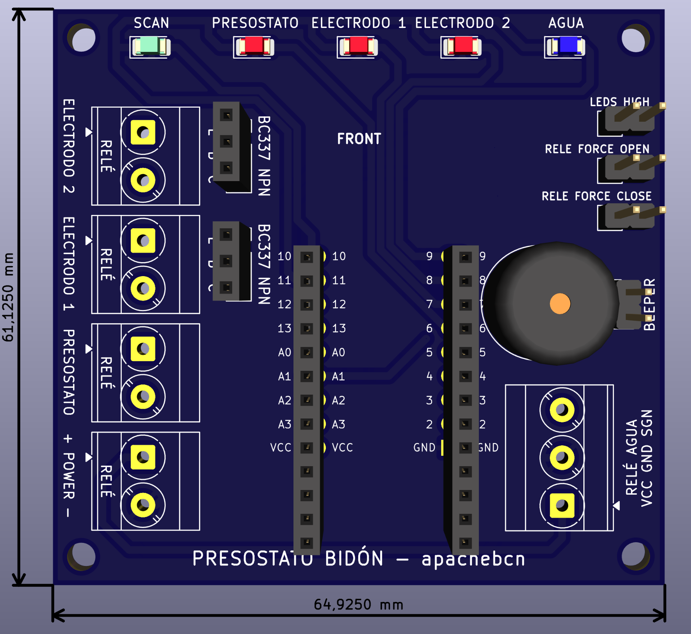
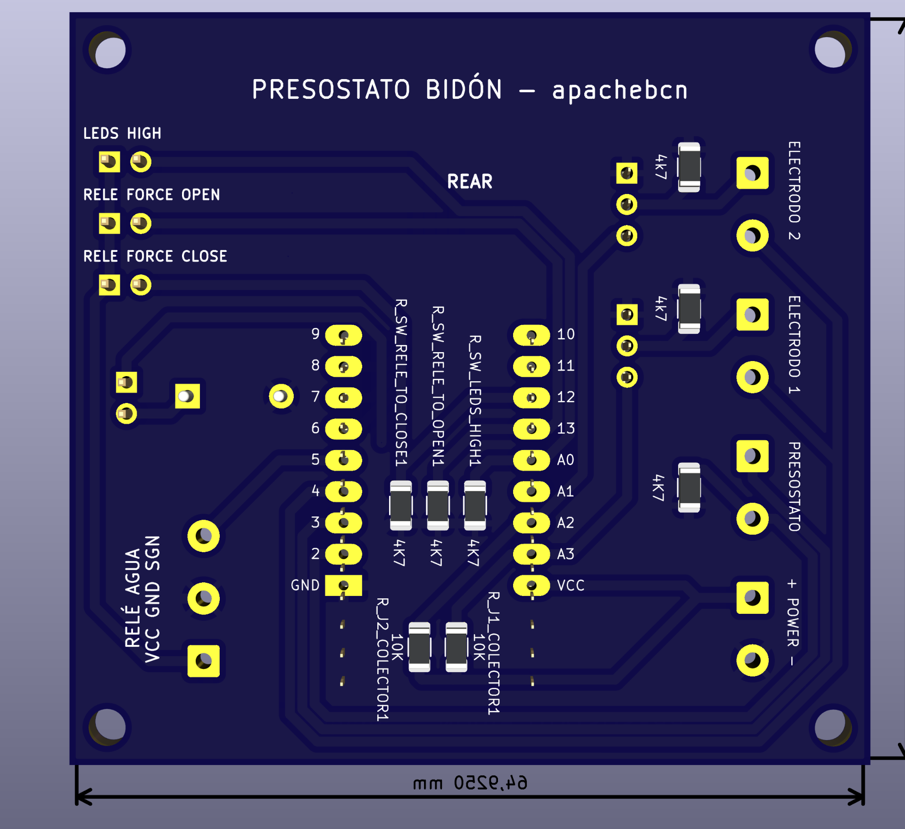
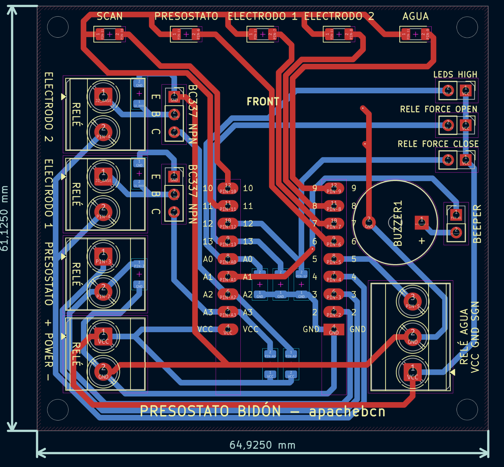

# Presostato de Agua para Bidón (Arduino)

Controlador de nivel de agua para un bidón o depósito, basado en **doble sensor redundante**, orientado a una instalación de **solar térmica casera** ([misolarcasero.com](https://misolarcasero.com)).

Escrito en Arduino (`.ino`), actúa como un **mantenedor de nivel**: detecta cuándo el depósito necesita agua, activa el relé de llenado (que puede gobernar una electroválvula o una bomba de agua) y lo desactiva al alcanzar el nivel de seguridad.

---

## Índice

1. [Principio de funcionamiento](#1-principio-de-funcionamiento)
2. [Esquema de pines](#2-esquema-de-pines)
3. [Detección del nivel](#3-detección-del-nivel)
4. [Lógica de control](#4-lógica-de-control)
5. [Alarma de fuga](#5-alarma-de-fuga)
6. [Configuración (`config_*.h`)](#6-configuración-config_h)
7. [Monitoreo serial](#7-monitoreo-serial)
8. [Placa y compilación](#8-placa-y-compilación)

---

## 1. Principio de funcionamiento

El funcionamiento no está fijado en el código: lo define el **perfil activo**. El hardware lee **dos electrodos conductivos** y **un sensor de nivel (presostato/nivel magnético)**, y el **motor de reglas** decide en cada ciclo, a partir de esas lecturas, si activa el relé (salida) y si activa la alarma.

Cada perfil declara sus reglas en texto (`profiles/<perfil>/config_rules.h`):

- **Entradas**: `E1` (electrodo 1), `E2` (electrodo 2), `L` (nivel) y `V` (valor resultante actual, para realimentación).
- **Salidas**: `RULES_FOR_RELAY` (relé ON/OFF) y `RULES_FOR_ALARM` (buzzer).
- Se evalúan **en orden** y gana la **primera que encaje**; si ninguna encaja, la salida queda en OFF.

### Perfiles incluidos

Se incluyen **tres perfiles** de ejemplo en `profiles/`:

| Perfil | Aplicación |
|---|---|
| `sample/` | Perfil de ejemplo. |
| `drum_filling/` | Mantener el nivel de llenado de un bidón. |
| `pump_protect/` | Proteger una **bomba de presión** para que nunca aspire aire del bidón. |

El perfil activo se elige cambiando el `#include` de `config_general.h` (ver [sección 6](#6-configuración-config_h)).

---

## 2. Esquema de pines

| Función | Pin |
|---|---|
| Salida a relé (electroválvula/bomba) | `PIN_RELE` → **5** |
| Pulso nivel | `PIN_LEVEL_PULSE` → **3** |
| Lectura nivel | `PIN_LEVEL_READ_DATA` → **2** |
| Pulso electrodos | `PIN_ELECTRODES_PULSE` → **4** |
| Lectura electrodo 1 | `PIN_ELECTRODE1_READ_DATA` → **A3** |
| Lectura electrodo 2 | `PIN_ELECTRODE2_READ_DATA` → **A2** |
| Jumper forzar relé ON | **13** |
| Jumper forzar relé OFF | **12** |
| Jumper brillo LEDs alto | **A0** |
| LED scan (pulso) | **10** |
| LED nivel | **6** |
| LED electrodo 1 | **7** |
| LED electrodo 2 | **8** |
| LED relé ON / alarma de fuga | **9** |
| Canal PWM brillo LEDs | **11** |
| Buzzer | **A1** |

---

## 3. Detección del nivel

Se combinan **dos sistemas de detección**: los **electrodos conductivos** (nivel objetivo de llenado) y el **presostato/nivel** (nivel de seguridad).

### 3.1 Electrodos conductivos

Dos pares de cables que marcan el **nivel objetivo de llenado**. Cuando el agua los toca, cierran el circuito y se detecta la conducción a través de un **transistor BC337**:

| Señal | Pin |
|---|---|
| Pulso de alimentación (compartido) | `PIN_ELECTRODES_PULSE` → **pin 4** |
| Lectura electrodo 1 | `PIN_ELECTRODE1_READ_DATA` → **A3** |
| Lectura electrodo 2 | `PIN_ELECTRODE2_READ_DATA` → **A2** |

El pulso de alimentación se mantiene el **tiempo mínimo imprescindible**: se arranca la conversión del ADC y el pulso se corta en cuanto el **sample & hold** ha capturado la tensión (unos **25-30 µs** en total, ver `analogReadShortPulse()`), en lugar de dejarlo activo los **~104 µs** que dura la conversión completa. El *sample & hold* es un circuito **interno del ATmega328P** (un interruptor y un condensador diminuto dentro del chip, **no** un componente de la placa): una vez cargado ese condensador con la tensión del pin, la entrada deja de influir en el resultado. Así la corriente por el agua —y con ella la **electrólisis** de los electrodos— se reduce ~4 veces, **sin pérdida de sensibilidad**: la muestra se captura exactamente en la misma ventana que usaría `analogRead()`. La función deduce el canal interno del ADC a partir del propio pin analógico (**A3**/**A2**), por lo que no ocupa ninguna línea adicional.

### 3.2 Presostato de lavadora, nivel magnético, o equivalentes (nivel de seguridad)

Interruptor activado por presión que cambia de estado según el nivel del agua. Se lee enviando un pulso de voltaje y leyendo la respuesta:

| Señal | Pin |
|---|---|
| Pulso de alimentación | `PIN_LEVEL_PULSE` → **pin 3** |
| Lectura de datos | `PIN_LEVEL_READ_DATA` → **pin 2** |

El pin de lectura lleva una **resistencia de 4,7 kΩ a GND**, y el código lee `!digitalRead()`:

| Estado del interruptor | Pin 2 | Lectura en bruto (`levelValue`) |
|---|---|---|
| **Cerrado** (conecta el pulso) | HIGH | **0** |
| **Abierto** (se va a GND) | LOW | **1** |

En este montaje el presostato está **cerrado con el nivel seco** y **abre al subir el agua**, por lo que "tocando agua" se representa con **1** (`LEVEL_WATER_TRUE_CONTACT_WITH_HARDWARE_GET_VALUE` en el `config_level.h` del perfil activo). Girar ese valor a **0** solo tiene sentido si el interruptor trabaja al contrario (usa el otro contacto NO/NC del presostato).

Con `PRINT_SERIAL_LEVEL_DEBUG_RAW` a **1** se imprime la lectura en bruto en cada decisión: seco el resultado debe ser **"LEVEL Tocando agua NO"** y mojado **"LEVEL Tocando agua SÍ"**.

---

## 4. Lógica de control

Con las lecturas, el código decide **activar o desactivar la salida** mediante las reglas del perfil (`RULES_FOR_RELAY` en `profiles/<perfil>/config_rules.h`) y actúa sobre un **relé** (`PIN_RELE`, **pin 5**) que gobierna la electroválvula o la bomba de agua. La **alarma** (buzzer) se decide con otro conjunto de reglas (`RULES_FOR_ALARM`).

- **Salida (relé)**: el resultado de `RULES_FOR_RELAY` es `1` = relé ON, `0` = relé OFF. Ejemplo: nivel seco → ON; sensor mojado → OFF (corte).
- **Alarma**: el resultado de `RULES_FOR_ALARM` activa el buzzer. Ejemplo: cualquier sensor mojado → alarma ON.
- **Testigos LED**: cada sensor enciende su LED según su macro `*_LED_ON_WHEN_WATER_CONTACT` (`1` = encendido al tocar agua, `0` = encendido en seco).
- **Override manual** mediante jumpers (se aplican FUERA de las reglas):
  - **Forzar relé ON** (pin 13): relé cerrado (ON) de forma indefinida.
  - **Forzar relé OFF** (pin 12): relé abierto (OFF).
  - **Brillo alto de LEDs** (A0).

---

## 5. Alarma de fuga

### 5.1 Principio

La alarma de fuga se basa en un principio simple: **el relé nunca debe permanecer activado de forma continua más tiempo del que dura su activación normal más larga**.

En régimen normal, el relé se activa y se desactiva de forma **intermitente** según las reglas del perfil (ver [sección 1](#1-principio-de-funcionamiento)). Cada activación tiene una duración previsible, por lo que:

> Una activación **continua e ininterrumpida** superior al umbral configurado solo puede deberse a un fallo: **relé bloqueado en ON**, **fuga en el circuito hidráulico**, o **avería en los sensores** que impide la orden de corte.

### 5.2 Configuración

```c
#define LEAK_ALARM_ENABLE 1        // 1 = activa la alarma de fuga, 0 = desactivada
#define LEAK_ALARM_TIME_SECONDS 20 // Tiempo máximo (segundos) con el relé activado
#define LEAK_ALARM_RELAY_STATE RELAY_OFF // Estado del relé al dispararse: RELAY_OFF (abrir) o RELAY_ON (cerrar)
```

Estos valores viven en `profiles/<perfil>/config_general.h` (son específicos de cada perfil).

- **`LEAK_ALARM_ENABLE`**: habilita o deshabilita el sistema de seguridad.
- **`LEAK_ALARM_TIME_SECONDS`**: umbral en segundos. Debe configurarse **por encima de la activación normal más larga del relé**, añadiendo un **margen de seguridad razonable**, empleando **tiempos previsibles y comprobados** sobre la salida (electroválvula o bomba) de la instalación. *Ejemplo:* si la activación normal dura ~40 s, un umbral de 60 s ofrece un margen amplio; si la activación puede durar varios minutos, el umbral deberá aumentarse en consecuencia.
- **`LEAK_ALARM_RELAY_STATE`**: estado que toma el relé cuando se dispara la alarma de fuga: **`RELAY_OFF`** = abierto (salida desactivada, lo habitual para cortar el agua) o **`RELAY_ON`** = cerrado (mantener la salida activa).

> **Nota clave**: el contador se **reinicia cada vez que el relé se desactiva**. Por tanto, las **activaciones intermitentes normales nunca se acumulan**; solo una activación **continua** superior al umbral dispara la alarma.

### 5.3 Comportamiento al dispararse

Cuando se supera el umbral, el sistema:

1. **Bloquea el sistema de forma irreversible**: el relé pasa al estado que define el perfil en `LEAK_ALARM_RELAY_STATE` (**`RELAY_OFF`** = abierto/salida desactivada, o **`RELAY_ON`** = cerrado). A partir de ese momento `getRelayActionOn()` devuelve siempre ese estado — ni los sensores ni los jumpers pueden reactivarlo.
2. **Luz de alarma**: **todos los leds** (nivel, electrodo 1, electrodo 2 y relé) parpadean de forma intermitente, distinguiendo visualmente la fuga del estado normal de operación. El led de **scan** (`PIN_SCAN_LED`, pin 10) conserva su función de pulso y no parpadea.
3. **Beeper**: suena una **sirena rápida y aguda** (`leak_alarm_sound()`, patrón distinto al de la alarma de electrodos) de forma periódica.
4. **Serial**: muestra el aviso `ALARMA RIESGO DE FUGA` (ver [sección 7](#7-monitoreo-serial)).

El desbloqueo solo es posible **reiniciando el Arduino**.

### 5.4 Excepción: relé forzado por jumper

La alarma de fuga **solo vigila la activación automática** del relé (la que deciden las reglas del perfil). Si el relé está **forzado por un jumper**, el contador se mantiene a cero y **no acumula tiempo**:

- **Jumper forzar relé ON** (pin 13): el relé queda cerrado (ON) de forma indefinida.
- **Jumper forzar relé OFF** (pin 12): el relé queda abierto (OFF).

Al quitar el jumper, el contador vuelve a empezar desde cero.

---

## 6. Configuración (`config_*.h` y perfiles)

La configuración se divide en dos partes:

### 6.1 Configuración global (compartida)

| Archivo | Contenido |
|---|---|
| `config_general.h` | Depuración (`PRINT_SERIAL`), jumpers, brillo PWM, estados lógicos (`LED_ON`/`LED_OFF`) y macros de tiempo. Además **selecciona el perfil activo** con su `#include`. |
| `config_pins.h` | Asignación física de pines (igual para todos los perfiles). |

### 6.2 Perfiles (`profiles/`)

Cada aplicación tiene una carpeta dentro de `profiles/` con su propia configuración de electrodos, nivel y reglas:

```
profiles/
├── sample/         ← perfil de ejemplo
├── drum_filling/   ← llenar bidón
└── pump_protect/   ← protección de bomba de presión
```

Dentro de cada carpeta de perfil:

| Archivo | Contenido |
|---|---|
| `profile.h` | Incluye los 5 ficheros del perfil. Es lo que se enlaza desde `config_general.h`. |
| `config_general.h` | Config general del perfil: `DELAY_IN_LOOP`, `DELAY_IN_ALARM`, `ADC_SAMPLE_HOLD_MICROSECONDS`, `RELAY_ON`/`RELAY_OFF`, `LEAK_ALARM_ENABLE`, `LEAK_ALARM_TIME_SECONDS`. |
| `config_electrode_1.h` | Config del electrodo 1: `PROCESS_ELECTRODE_1`, umbral, polaridad, `ELECTRODE_1_ALARM_ENABLE`, `ELECTRODE_1_LED_ON_WHEN_WATER_CONTACT`. |
| `config_electrode_2.h` | Igual que E1, con macros `ELECTRODE_2_*`. |
| `config_level.h` | Config del nivel/presostato: `PROCESS_LEVEL`, `LEVEL_WATER_TRUE_CONTACT_WITH_HARDWARE_GET_VALUE`, `LEVEL_ALARM_ENABLE`, `LEVEL_LED_ON_WHEN_WATER_CONTACT`. |
| `config_rules.h` | Reglas de la salida (`RULES_FOR_RELAY`) y de la alarma (`RULES_FOR_ALARM`). |

Para cambiar de perfil, cambia la línea `#include` al principio de `config_general.h`, p. ej.:

```c
#include "profiles/drum_filling/profile.h"
```

Formato de las reglas (`config_rules.h`): una por línea, `NOMBRE=0/1[&NOMBRE=0/1...][|alternativa...]:SALIDA` — `&` = Y, `|` = O, `SALIDA` = `1` (ON) o `0` (OFF). Nombres: `E1`, `E2`, `L`, `V` (valor resultante actual: en `RULES_FOR_RELAY` `V` es el estado del relé, y en `RULES_FOR_ALARM` el estado de la alarma).

> **No existe un `config.h` único**: la configuración global está en `config_general.h` + `config_pins.h`, y lo específico de cada aplicación en su carpeta de `profiles/`. No dupliques macros: si un valor apareciese en dos sitios, ganaría el del último archivo incluido.

---

## 7. Monitoreo serial

A **115200 baudios**, el sistema informa de su estado en cada ciclo `LOOP`:

- Estado de los jumpers (`SWITCH CLOSED: ...`).
- Resultado de cada sensor (`RESULTADO -> LEVEL/ELECTRODE ... Tocando agua SÍ/NO`).
- Estado de la salida (`RELE ON (1)` / `RELE OFF (0)`).
- Al arrancar se imprimen las reglas cargadas (`REGLAS CARGADAS` + entradas detectadas) para `RULES_FOR_RELAY` y `RULES_FOR_ALARM`.
- **Alarma de fuga**: al dispararse muestra `ALARMA RIESGO DE FUGA: RELE ACTIVADO DURANTE MAS DE LEAK_ALARM_TIME_SECONDS` y `SISTEMA BLOQUEADO. REINICIAR EL ARDUINO PARA DESBLOQUEAR.`; mientras permanezca bloqueado, recuerda en cada ciclo `ALARMA RIESGO DE FUGA ACTIVA: SISTEMA BLOQUEADO`.

---

## 8. Placa y compilación

Pensado para **Arduino Pro Mini (ATmega328P)**, en cualquiera de sus dos versiones:

| Versión | Reloj | `ADC_SAMPLE_HOLD_MICROSECONDS` |
|---|---|---|
| Pro Mini 5 V | 16 MHz | 25 µs |
| Pro Mini 3,3 V | 8 MHz | 45 µs |

El valor **se calcula solo** a partir de `F_CPU`, así que no hay que ajustar nada al cambiar de versión.

En la versión de **3,3 V** el pulso y la referencia del ADC son de 3,3 V en lugar de 5 V: conviene recalibrar `ELECTRODE_1_CONTACT_ANALOG_THRESHOLD` / `ELECTRODE_2_CONTACT_ANALOG_THRESHOLD` con `PRINT_SERIAL_ELECTRODE_1_DEBUG_RAW` / `PRINT_SERIAL_ELECTRODE_2_DEBUG_RAW` activados.

Todo lo específico del micro (los registros del ADC) está en una sola función, `analogReadShortPulse()`.

### 8.1 Diseño de la placa (KiCad)

Puedes hacerte tu propio circuito en un protoboard siguiendo el mismo esquema.


Vistas de la placa diseñada en **KiCad**:

**Vista frontal (componentes y serigrafía):**



**Vista trasera (pistas y soldaduras):**



**Enrutado / capas (pistas de cobre):**

